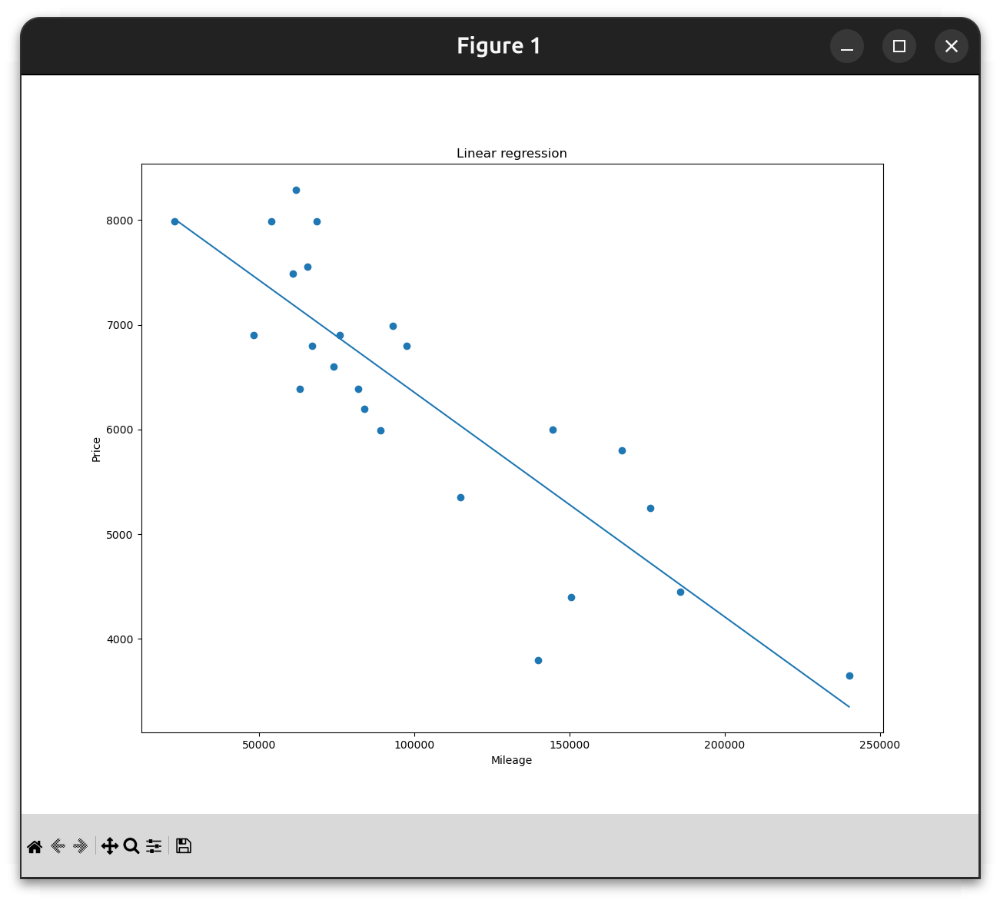

# ft_linear_regression

Ce projet implémente une régression linéaire simple pour estimer le prix d'une voiture à partir de son kilométrage.

Le modèle utilise la formule suivante :

```text
estimatePrice = theta0 + theta1 * mileage
```

Les kilomètres sont normalisés pendant l'entraînement pour garder des valeurs entre `0` et `1` :

```text
km_normalized = (km - min_km) / (max_km - min_km)
```

`min_km` et `max_km` sont sauvegardés avec le modèle afin que `predict.py` puisse appliquer la même normalisation aux valeurs saisies par l'utilisateur.

## Fichiers

```text
data.csv       Dataset contenant les colonnes km et price
train.py       Entraîne le modèle avec une descente de gradient
predict.py     Prédit un prix à partir d'un kilométrage utilisateur
precision.py   Calcule MAE, MSE et R2
plot.py        Affiche les données et la droite de régression
```

`model.json` est généré par `train.py` et n'est pas versionné.

## Utilisation

Entraîner le modèle :

```bash
python3 train.py
```

Faire une prédiction :

```bash
python3 predict.py
```

Calculer la précision du modèle :

```bash
python3 precision.py
```

Afficher le graphe :

```bash
python3 plot.py
```

## Résultat

Après entraînement sur `data.csv`, le modèle obtenu est :

```text
theta0 = 8008.439832646822
theta1 = -4656.591444722153
```

Avec les métriques suivantes :

```text
MAE: 557.84
MSE: 445645.25
R2: 0.7330
```

Le graphe ci-dessous montre les données du dataset et la droite apprise par la régression linéaire :



## Méthode

L'entraînement commence avec :

```text
theta0 = 0
theta1 = 0
```

A chaque itération, le programme calcule l'erreur entre le prix prédit et le prix réel, puis met à jour les paramètres avec la descente de gradient :

```text
tmpTheta0 = learningRate * (1 / m) * sum(prediction - real_price)
tmpTheta1 = learningRate * (1 / m) * sum((prediction - real_price) * km_normalized)

theta0 = theta0 - tmpTheta0
theta1 = theta1 - tmpTheta1
```

On soustrait le gradient parce qu'il indique la direction dans laquelle l'erreur augmente. En allant dans la direction opposée, le modèle réduit progressivement son erreur.

## Gestion des erreurs

Le projet gère notamment :

- fichier `data.csv` manquant
- dataset vide
- colonnes `km` ou `price` absentes
- ligne CSV invalide
- valeur non numérique
- division par zéro si tous les kilomètres sont identiques
- absence de `model.json` dans `predict.py`

## Bonus

Bonus implémentés :

- affichage des points du dataset
- affichage de la droite de régression
- calcul de la MAE
- calcul de la MSE
- calcul du R2
